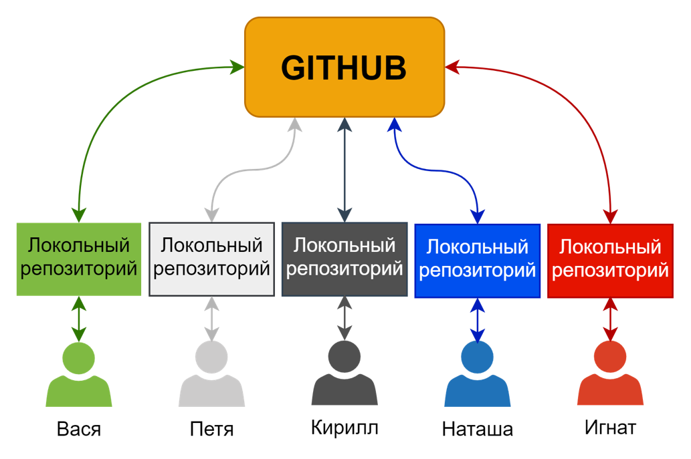
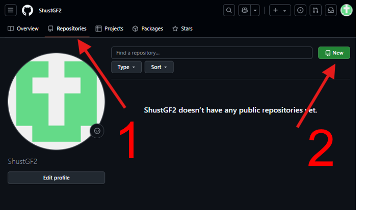
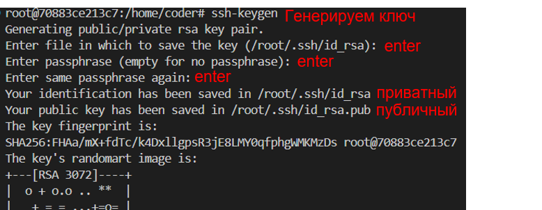
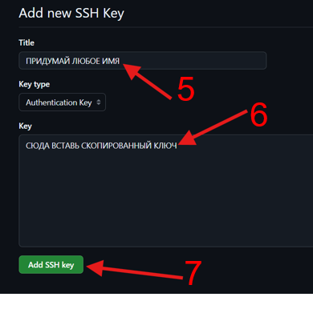
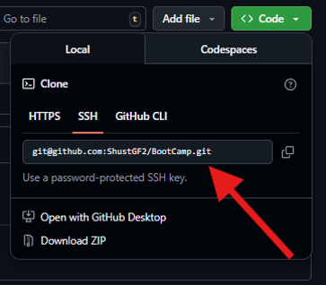
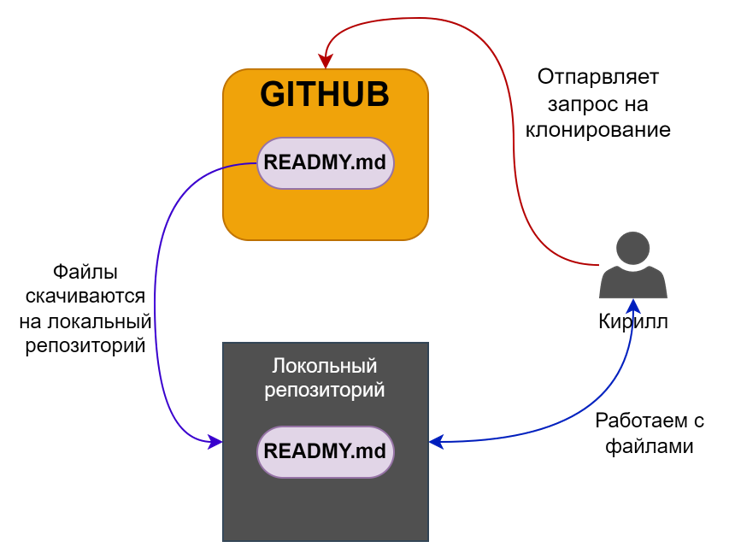
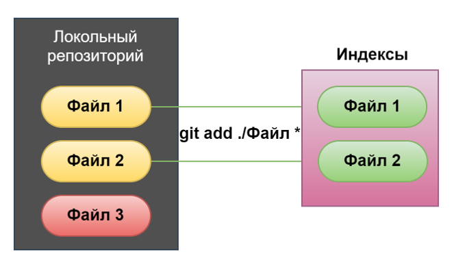
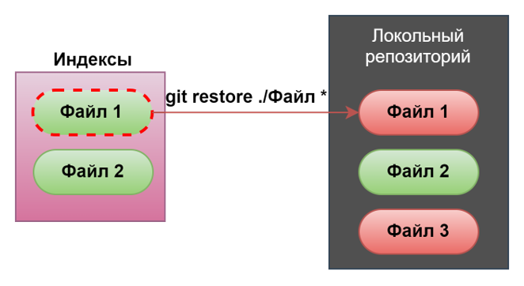
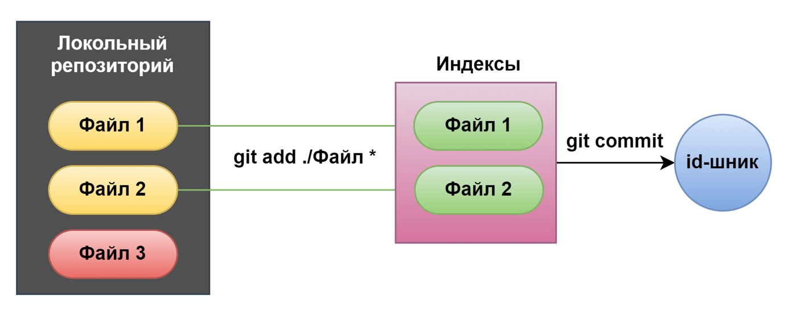

<!-- Yandex.Metrika counter -->
<script type="text/javascript">
    (function(m,e,t,r,i,k,a){
        m[i]=m[i]||function(){(m[i].a=m[i].a||[]).push(arguments)};
        m[i].l=1*new Date();
        for (var j = 0; j < document.scripts.length; j++) {if (document.scripts[j].src === r) { return; }}
        k=e.createElement(t),a=e.getElementsByTagName(t)[0],k.async=1,k.src=r,a.parentNode.insertBefore(k,a)
    })(window, document,'script','https://mc.yandex.ru/metrika/tag.js?id=103580753', 'ym');

    ym(103580753, 'init', {ssr:true, webvisor:true, clickmap:true, ecommerce:"dataLayer", accurateTrackBounce:true, trackLinks:true});
</script>
<noscript><div></div></noscript>
<!-- /Yandex.Metrika counter -->
## Куратор раздела


**Шустиков Владимир**, оставивший военную жизнь позади и ушедший в данные с головой. Работаю с данными более 2х лет и останавливаться не собираюсь! Веду:

   [Telegram канал](https://t.me/Shust_DE)
   
   [Youtube канал](https://www.youtube.com/@shust_de)

Если хочешь сменить текущую профессию на Дата Инженера — пиши не стесняйся, я сам проходил этот не легкий путь и тебе помогу https://t.me/ShustDE

Хочешь улучшить текущий раздел, внести недостающее или поправить формулировку? Предлагай PR и тегай [@ShustGF](https://github.com/ShustGF).

## Что такое GIT?

GIT - это фреймворк или просто система контроля версий. Ты мне не поверишь, но она нужна исключительно для того, чтобы контролировать, как изменяется твой проект(каталог с текстовыми файликами). Чтобы в случае проблем ты мог быстро откатитсья на шаг или несколько назад, не более того.

### Принципы работы

Существует 3 принципа работы систем контроля версий:

- Локальное управление версиями;
- Децентрализованное управления версиями;
- Централизованное управление версиями.

####  Локальное управление версиями

Локальное управление версиями, по сути из себя представляет твое собственное локальное окружение (работает у тебя на локальном компе).

<p align="center">
    
</p>

####  Децентрализованное управления версиями

Принцип всем известного GITHUB(о нём мы поговорим дальше). Смысл в том, что Вася работает в команде с Петей и им ну очень хочется общие наработки держать в одном месте и контралировать как ведется проект. Поэтому у них у каждого есть **локальное управление версиями**, а потом они скидывают свои наработки на общий сервер.

<p align="center">
    
</p>

####  Централизованное управления версиями

Тут не буду особо разглогольствовать, посмотри на картинку выше и представь, что Вася и Петя ходят на пряму в общий сервер и меняют там на прямую файлы, без скачивания их на локальный компьютер.

## Что такое GITHUB?

Как уже говорилось **GITHUB** - это децентрализованная система управления версиями. В ней создается свой репозиторий (это считай каталог), в который ты и твои коллеги могут оправлять изменения.

<p align="center">
    
</p>

### Создаем собственный репозиторий.

Создать репозиторий очень просто:

1. Зайди во вкладку **Repositories**
2. Нажми зелёную кнопку **New**
   
<p align="center">
    
</p>

3. Впиши уникальное имя твоего проекта
4. Выбери публичный или приватный репозиторий
5. Я люблю создавать репозиторий с созданым файлом **READMY**, а ты делай как хочешь
6. Нажми большую, зелёную кнопку **Create repository**

<p align="center">
    
</p>

Не так уж тяжело, ну если вдруг тяжело, то может ну это IT ты задумайтся!

### Прокидываем SSH-ключ.

Чтобы скачать и загрузить изменнения в свой репозиторий в первую очередь необходимо добавить, так называемый SSH-ключ. Грубо говоря с помощью него твое пространство в GITHUB будет понимать, что твоему компьютеру можно доверять и применять изменения, в противном случае **access denied**, ёпт...

Ну что го прокидывать, тут тоже ниче сложного, смотри:

1. Заходишь в свой терминал или git bash
2. Прописиваешь команду 
```bash
ssh-keygen
```
3. тебе предложать изменить каталог где будет хранится ключ и ввести кодовую фразу для генерацию ключа, забей болтяру и жми как все специ 3 раз **Enter**

<p align="center">
    
</p>

4. Тебе нужно зайти в файл с **публичным**(не перепутай с приватным и вообще никому не показывай приватный ключ, НИ-КОГ-ДА!) ключом и **скопировать** его.
5. Возвращайся в GITHUB
6. Тыкай на своего перосонажа и переходи в настройки

<p align="center">
    
</p>

7. С правой стороны перейди во вкладку **SSH and GPG keys** и тыкни очередную большую, зелёную кнопку **New SSH key**

<p align="center">
    
</p>

8. Придумай название и вставь скопированый ключ и не промаж по БОЛЬШОЙ, ЗЕЛЕНОЙ КНОПКЕ.

<p align="center">
    
</p>

Всё ты молодец, самое сложное, то что делается навернео 1 раз в жизни, ну может 2, ты переосилил.

## Джентельменский набор команд

Сейчас мы рассмотрим то, что необходимо знать каждому уважающему себя IT-шнику, который сталкивается с гитом.

### git clone

```bash
git clone <адрес репозитория> 
```

По сути это самая первая команда, которая клонирует перозиторий в твой каталог.

Адрес репозитория находится в ЗЕЛЕНОЙ кнопке **Code** во вкладке **SSH**

<p align="center">
    
</p>

Как это работает:
1) Ты отправляешь запрос на клонирование
2) К тебе скачиваются в локальный репозиторий файлы 
3) Ты начинаешь с ними работать
   
<p align="center">
    
</p>

### git add/restore

```bash
git add <файл/каталог>
```

Это прям пушка команда, перед тем как тебе отправить данные на изменения в общий репозиторий, тебе необходимо сказать гиту, какие именно файлы ты хочешь отправить в GITHUB.

<p align="center">
    
</p>


А теперь представь ты добавил не тот каколог или файл, что делать, ну конечно нужно удалить твое добавление, делается это так:

```bash
git restore <файл/каталог>
```

Ну в целом вот что произойдет с твоим файлом.

<p align="center">
    
</p>

### git commit

```bash
git commit –m “<комментарий к коммиту>”
```

Это самая важная команда и постоянно идет в ногу с командой добавления. Данная команда присваивает твоим изменениям индентификатор, по которому можно все твое добро отследить.

<p align="center">
    
</p>

### git push

```bash
git push origin <имя ветки>
```

Ну всё, это, по сути, конечная команда в твоей работе, которая отправляет твои изменения в репозиторий.

<p align="center">
    
</p>

### git pull

```bash
git pull origin <имя ветки>
```

Куча народу запушила свои измения в репозиторий, теперь необходимо, скачать все эти измения. Просто выполни команду выше.

<p align="center">
    
</p>

О чудо... Но это еще не всё, мы преходим к самой страшной теме ВЕТОККККК....

### git branch/checkout

Слушай я честно скажу, что не знаю чего все боятся этих веток, но просто запомни следующие команды.

- выдает список веток

```bash
git branch
```

- создает новую ветку

```bash
git branch <имя ветки>
```
- переключение на ветку

```bash
git checkout <имя ветки>
```

- создает и переключаетcz на новую ветку

```bash
git checkout -b <имя ветки>
```

Тут в целом рассписывать очень долго поэому я порекомендую посмотреть моё видео(➜ [Видео по работе с github / git на примере Bootcamp'а](https://youtu.be/dflUnlOTUic)), где я объясняю принцип работы с ветками и возникающие коализии. Но если хочешь можешь попробовать разобраться сам, лови картинку:

<p align="center">
    
</p>